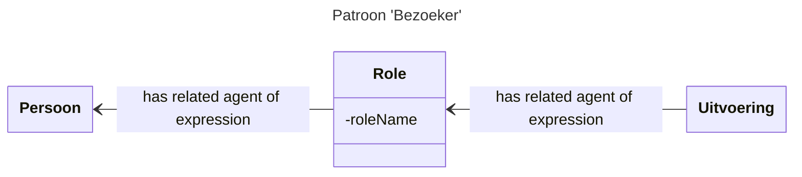
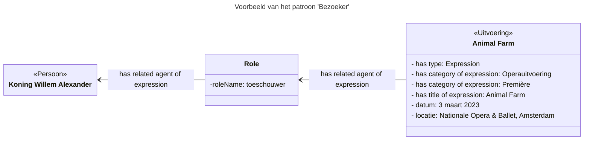

# Patroon: Bezoeker
## Context
Je wilt de aanwezigheid vastleggen van een specifieke bezoeker bij een bepaalde uitvoering. 
## Structuur

```mermaid
---
title: Patroon 'Bezoeker'
config:
 class:
  hideEmptyMembersBox: true
---
classDiagram
	direction RL
	Uitvoering --> Role: has related agent of expression
	Role --> Persoon: has related agent of expression
	
class Role{
 -roleName
}
```

## Voorbeeld

```mermaid
---
title: Voorbeeld van het patroon 'Bezoeker'
config:
 class:
  hideEmptyMembersBox: true
---
classDiagram
	direction RL
	AnimalFarm --> Role: has related agent of expression
	Role --> KoningWillemAlexander: has related agent of expression
	
class AnimalFarm ["Animal Farm"] {
 <<Uitvoering>>
 - has type: Expression
 - has category of expression: Operauitvoering
 - has category of expression: Première
 - has title of expression: Animal Farm
 - datum: 3 maart 2023
 - locatie: Nationale Opera & Ballet, Amsterdam
}

class Role{
 -roleName: toeschouwer
}

class KoningWillemAlexander ["Koning Willem Alexander"] {
 <<Persoon>>
}
```
## Gerelateerde patronen
Uitvoeringsrol