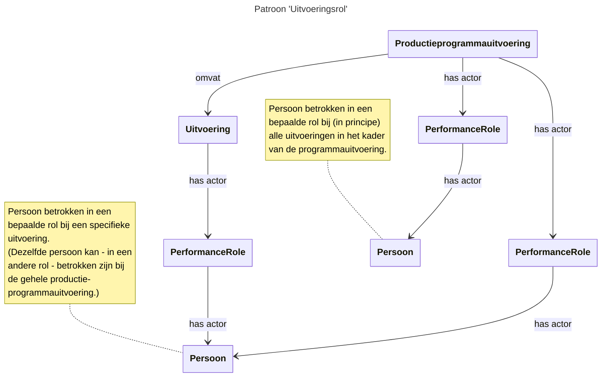
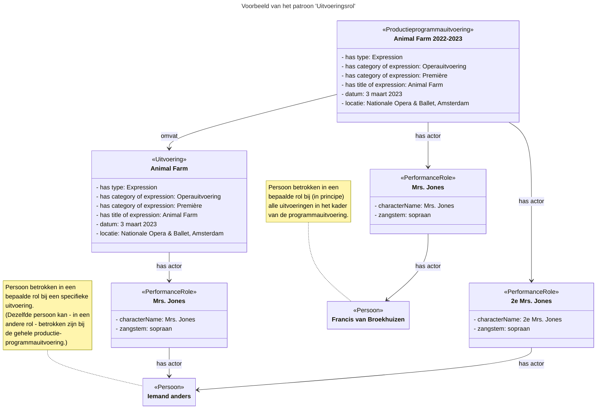

# Patroon: Uitvoeringsrol

## Context
Je wilt vastleggen welke rol een uitvoerende heeft bij een bepaalde uitvoering. 

## Structuur

```mermaid
---
title: Patroon 'Uitvoeringsrol'
config:
 class:
  hideEmptyMembersBox: true
---
classDiagram
	direction TD
	class PerformanceRole2["PerformanceRole"]
	class PerformanceRole3["PerformanceRole"]
	class Persoon2["Persoon"]
	
	Productieprogrammauitvoering --> Uitvoering: omvat
	Productieprogrammauitvoering --> PerformanceRole: has actor
	PerformanceRole --> Persoon: has actor
	Uitvoering --> PerformanceRole2: has actor
	PerformanceRole2 --> Persoon2: has actor
	Productieprogrammauitvoering --> PerformanceRole3: has actor
	PerformanceRole3 --> Persoon2: has actor
	
	note for Persoon "Persoon betrokken in een 
					bepaalde rol bij (in principe) 
					alle uitvoeringen in het kader 
					van de programmauitvoering."
	
	note for Persoon2 "Persoon betrokken in een 
						bepaalde rol bij een specifieke
						uitvoering. 
						(Dezelfde persoon kan - in een 
						andere rol - betrokken zijn bij 
						de gehele productie- 
						programmauitvoering.)" 

```

## Voorbeeld

```mermaid
---
title: Voorbeeld van het patroon 'Uitvoeringsrol'
config:
 class:
  hideEmptyMembersBox: true
---
classDiagram
	direction TD
	class Productieprogrammauitvoering["Animal Farm 2022-2023"] {
		<<Productieprogrammauitvoering>>		
		- has type: Expression
		- has category of expression: Operauitvoering
		- has category of expression: Première
		- has title of expression: Animal Farm
		- datum: 3 maart 2023
		- locatie: Nationale Opera & Ballet, Amsterdam
	}
	class Uitvoering["Animal Farm"] {
		<<Uitvoering>>		
		- has type: Expression
		- has category of expression: Operauitvoering
		- has category of expression: Première
		- has title of expression: Animal Farm
		- datum: 3 maart 2023
		- locatie: Nationale Opera & Ballet, Amsterdam
	}
	class PerformanceRole["Mrs. Jones"] {
		<<PerformanceRole>>
		- characterName: Mrs. Jones
		- zangstem: sopraan  
	}
	class PerformanceRole2["Mrs. Jones"] {
		<<PerformanceRole>>
		- characterName: Mrs. Jones
		- zangstem: sopraan  
	}
	class PerformanceRole3["2e Mrs. Jones"] {
		<<PerformanceRole>>
		- characterName: 2e Mrs. Jones
		- zangstem: sopraan  
	}
	class Persoon["Francis van Broekhuizen"] {
		<<Persoon>>
	}
	class Persoon2["Iemand anders"] {
		<<Persoon>>
	}
	
	Productieprogrammauitvoering --> Uitvoering: omvat
	Productieprogrammauitvoering --> PerformanceRole: has actor
	PerformanceRole --> Persoon: has actor
	Uitvoering --> PerformanceRole2: has actor
	PerformanceRole2 --> Persoon2: has actor
	Productieprogrammauitvoering --> PerformanceRole3: has actor
	PerformanceRole3 --> Persoon2: has actor
	
	note for Persoon "Persoon betrokken in een 
					bepaalde rol bij (in principe) 
					alle uitvoeringen in het kader 
					van de programmauitvoering."
	
	note for Persoon2 "Persoon betrokken in een 
						bepaalde rol bij een specifieke
						uitvoering. 
						(Dezelfde persoon kan - in een 
						andere rol - betrokken zijn bij 
						de gehele productie- 
						programmauitvoering.)" 

```

## Gerelateerde patronen
Bezoeker