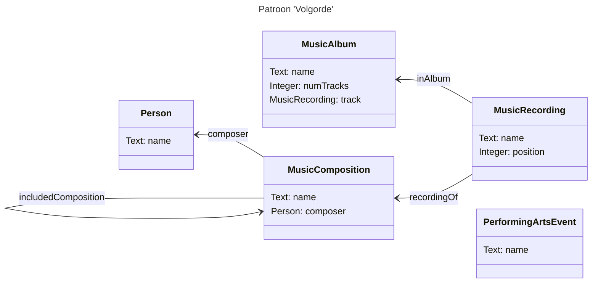

# Patroon: volgorde
## Context
Volgorde uitvoeringen (bv. tracks cd)
Uitwerking in schema.org

## Structuur

```mermaid
---
title: Patroon 'Volgorde'
config:
 class:
  hideEmptyMembersBox: true
---
classDiagram
	direction RL
    MusicRecording --> MusicAlbum: inAlbum
    MusicRecording --> MusicComposition: recordingOf
    MusicComposition --> MusicComposition: includedComposition
    MusicComposition --> Person: composer
class MusicAlbum{
    Text: name
    Integer: numTracks
    MusicRecording: track
}
class MusicRecording{
    Text: name
    Integer: position
}
class MusicComposition{
    Text: name
    Person: composer
}
class Person{
    Text: name
}
class PerformingArtsEvent{
    Text: name
}
```

## Voorbeeld

## Gerelateerde patronen