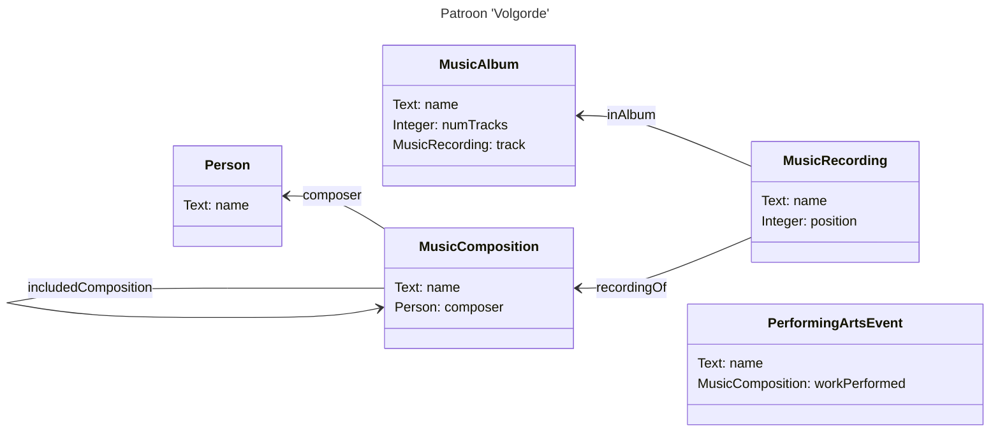
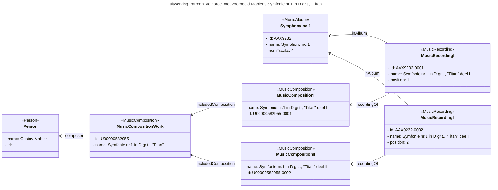

# Patroon: volgorde
## Context
Volgorde uitvoeringen (bv. tracks cd)
Uitwerking in schema.org

## Structuur

## Voorbeeld
A CD from the Muziekweb collection has been modeled as MusicAlbum in schema.org. A MusicAlbum is derived from MusicPlaylist, which is derived from CreativeWork. A MusicPlaylist can contain several MusicRecordings, each having a 'position' property. By ordering the values of the position property (ascending) the MusicRecordings (the tracks of the CD) can be played in the right order (as they are listed on the CD). 

Each MusicRecording can be linked to a MusicComposition using the property 'recordingOf'. Each track in this example is a recording of a part of the Symphony. Therefor, the MusicComposition that is linked to the MusicRecording is modeled with the 'includedComposition' property that links the part to the whole.

The whole Symphony (the Work) being modeled as MusicComposition has a 'composer' property that links the composer Person to the Work.

Note: For simplicity, we only modeled two tracks, where the CD has four tracks (and the Symphony four parts, or movements).

Note: The recording on this CD can not be modeled as PerformingArtsEvent, because it was not registered in front of an audience. It could be modeled as being a MusicEvent, but that is not part of this example.

## Gerelateerde patronen