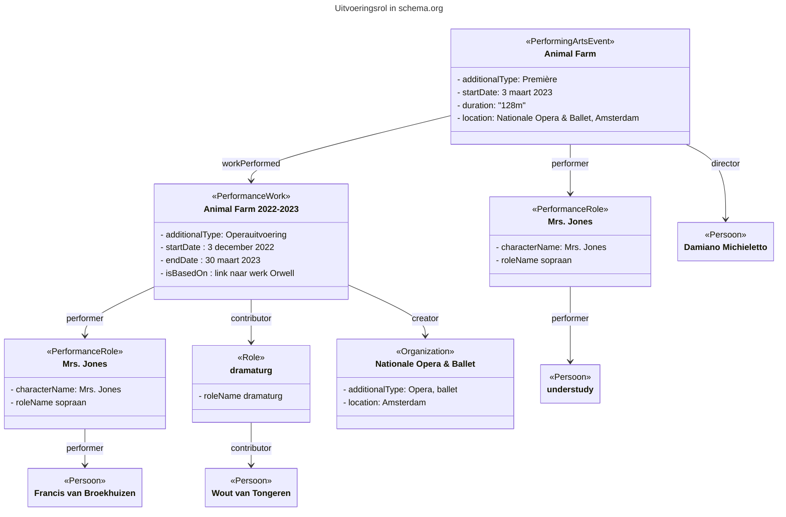

# Voorbeeld: Uitvoeringsrol

## Context
Het vastleggen van de rol van een uitvoerende in schema.org.
Dit voorbeeld bevat twee verschillende methodieken:
- bij sommige classes zoals PerformingartsEvent bestaat de "director" property en kan die "rol" zonder schema:Role class gemodelleerd worden.
- bij andere classes zoals PerformanceWork bestaan die niet en moet het via de meer generieke contributor property en wel met de Role class. 

Note: de additionalTypes hieronder zijn uitgeschreven maar dat moeten termen uit een (theater)thesaurus worden.

## Voorbeeld

## Gerelateerde patronen
Bezoeker