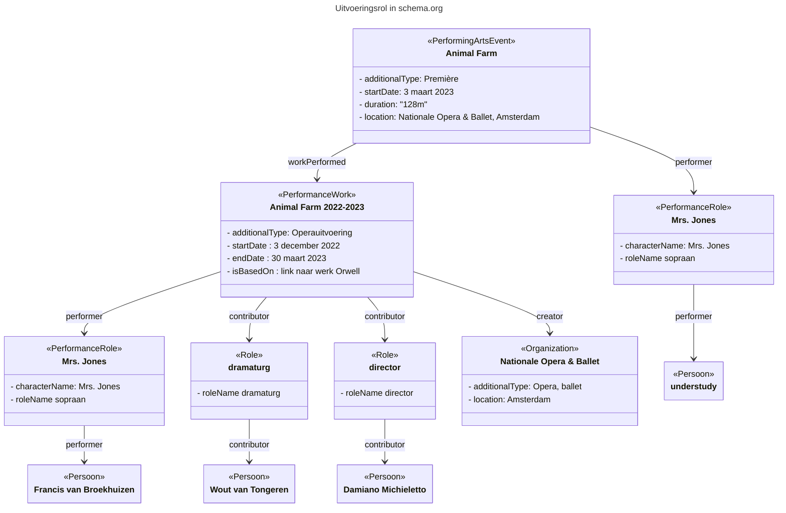

# Voorbeeld: Uitvoeringsrol

## Context
Het vastleggen van de rol van een uitvoerende in schema.org.

Er is een keuze gemaakt om alle rollen - waar specificatie nodig is - vast te leggen via de schema:Role of PerformanceRole class. 
Zowel bij de Productie als de uitvoering; dus van een PerformingArtsEvent wordt niet rechtstreeks de property "director" gebruikt, omdat je dat vaak voor een productie-seizoen (PerformanceWork/CreativeWork) wilt vastleggen, wat die director property niet heeft.  
Dus zie onderstaand voorbeeld voor die modellering.

Note: de additionalTypes en de rollen hieronder zijn uitgeschreven maar dat moeten termen uit een (theater)thesaurus worden.

## Voorbeeld

## Gerelateerde patronen
Bezoeker